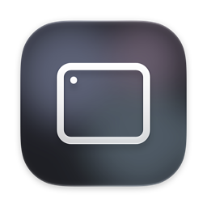
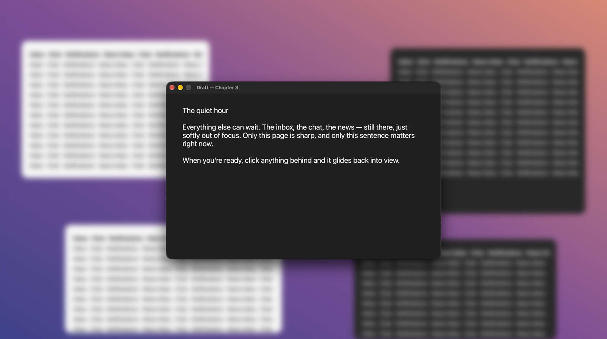
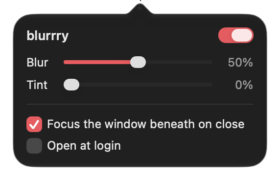

<p align="center">
  
</p>

<h1 align="center">blurrry</h1>

<p align="center">
  <b>Blur everything but the app you're using.</b><br>
  A tiny, native macOS menu bar app that keeps your focus where it belongs.
</p>

<p align="center">
  
</p>

Most "focus" utilities just dim the background. blurrry actually **blurs** it — a real, live, GPU-rendered blur — so the window you're working in is the only thing in focus and everything else fades into a soft haze.

## Features

- **Real blur, not dimming.** Everything behind the active app is blurred live by the window server, with an optional colour tint.
- **Whole-app focus.** Every window of the app you're using stays sharp — second windows, sheets, popovers, separate Mail messages. Nothing inside the active app is ever blurred.
- **Smooth, quiet transitions.** When you switch apps, only the windows that change fade in or out; the rest of the screen never moves.
- **Focus follows you.** Close a window and blurrry hands keyboard focus to the window beneath it — no extra click.
- **Desktop aware.** Click the wallpaper and the blur steps aside so you can see your desktop; click it again and you're back where you were.
- **Lives in the menu bar.** No Dock icon, no windows on launch. Toggle with <kbd>⌃</kbd><kbd>⌥</kbd><kbd>⌘</kbd><kbd>B</kbd>.
- **No permissions.** No Accessibility, no Screen Recording, no network access. It stores nothing but its own settings.

<p align="center">
  
</p>

## Install

Requires macOS 14 Sonoma or later. Runs natively on Apple silicon and Intel.

### Homebrew

```bash
brew install --cask pempixo/tap/blurrry
```

### Download

1. Grab `blurrry-x.y.dmg` from the [latest release](https://github.com/pempixo/blurrry/releases/latest).
2. Open it and drag **blurrry** into **Applications**.
3. Launch blurrry — its icon appears in the menu bar.

> [!NOTE]
> blurrry isn't notarized by Apple yet, so the first launch of a downloaded copy is blocked by Gatekeeper.
> Open **System Settings → Privacy & Security** and click **Open Anyway**, or run:
> ```bash
> xattr -dr com.apple.quarantine /Applications/blurrry.app
> ```
> The Homebrew cask takes care of this for you.

## Usage

Click the menu bar icon to open the panel:

| Control | What it does |
| --- | --- |
| Switch | Turns the blur on or off (same as <kbd>⌃</kbd><kbd>⌥</kbd><kbd>⌘</kbd><kbd>B</kbd>) |
| Blur | How strong the blur is |
| Tint | Washes the background in your system accent colour |
| Focus the window beneath on close | Hands focus to the next window when you close one |
| Open at login | Starts blurrry quietly in the menu bar when you log in |

Right-click the menu bar icon to quit.

## Build from source

Needs Xcode 26 or later (for the Swift toolchain and the layered app icon).

```bash
git clone https://github.com/pempixo/blurrry.git
cd blurrry
./build.sh        # builds build/blurrry.app (universal)
./dmg.sh          # also packages dist/blurrry-<version>.dmg
```

## How it works

blurrry places a click-through, full-screen window directly beneath the active app's front window. That window uses Core Animation's backdrop layer to blur and tint whatever lies behind it, and cuts sharp "holes" wherever the active app's other windows are visible. Focus changes are tracked by watching the on-screen window list, so no special permissions are needed.

This relies on private macOS APIs (the backdrop layer and a SkyLight call for focusing windows), which is also why blurrry isn't on the Mac App Store. A future macOS update could break these; blurrry falls back to simpler methods where it can.

## License

[MIT](LICENSE)
